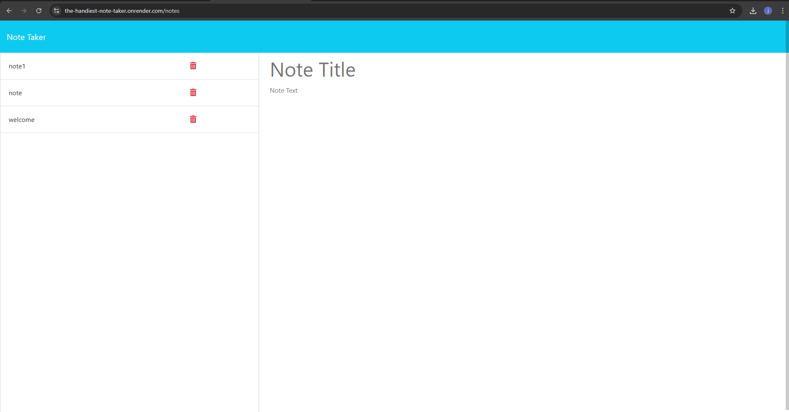

# Note Taker

## Description

The Note Taker application allows users to write, save, and delete notes. It is designed to help users organize their thoughts and manage tasks efficiently. The application features a user-friendly interface with a front end that connects to an Express.js back end. Notes are stored in a JSON file on the server, ensuring that users can retrieve their saved notes anytime.

## Features

- **Write and Save Notes:** Users can create new notes by entering a title and text, which can then be saved.
- **View Existing Notes:** Saved notes are displayed in a list, allowing users to easily access and review them.
- **Delete Notes:** Users can delete notes they no longer need.

## Technologies Used

- **Front End:** HTML, CSS, JavaScript
- **Back End:** Node.js, Express.js
- **Data Storage:** JSON file

## Installation

1. Clone the repository:
   AAA
   git clone https://github.com/yourusername/note-taker.git
   AAA

2. Navigate to the project directory:
   AAA
   cd note-taker
   AAA

3. Install dependencies:
   AAA
   npm install
   AAA

4. Start the application:
   AAA
   npm start
   AAA

   The application will be available at `http://localhost:3000`.

## API Endpoints

- `GET /api/notes`: Retrieves all saved notes.
- `POST /api/notes`: Adds a new note and saves it to the server.
- `DELETE /api/notes/:id`: Deletes a note by its unique ID.

## Deployment

The application is deployed on Render and can be accessed at the following URL:

[Note Taker Live Application](https://the-handiest-note-taker.onrender.com/)

## Screenshots

## License

This project is licensed under the MIT License.

